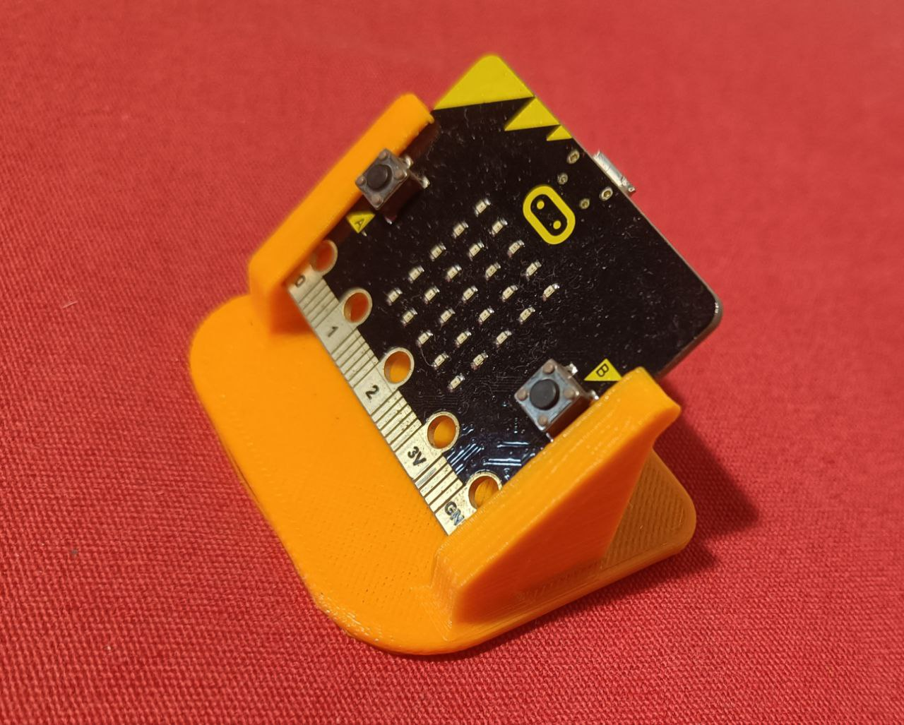
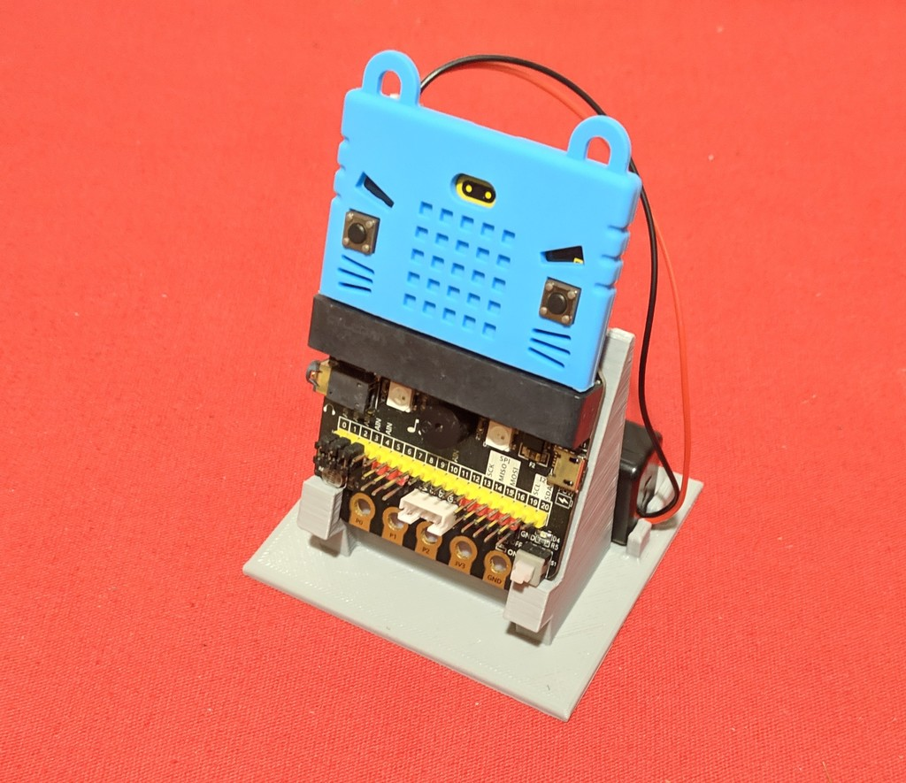
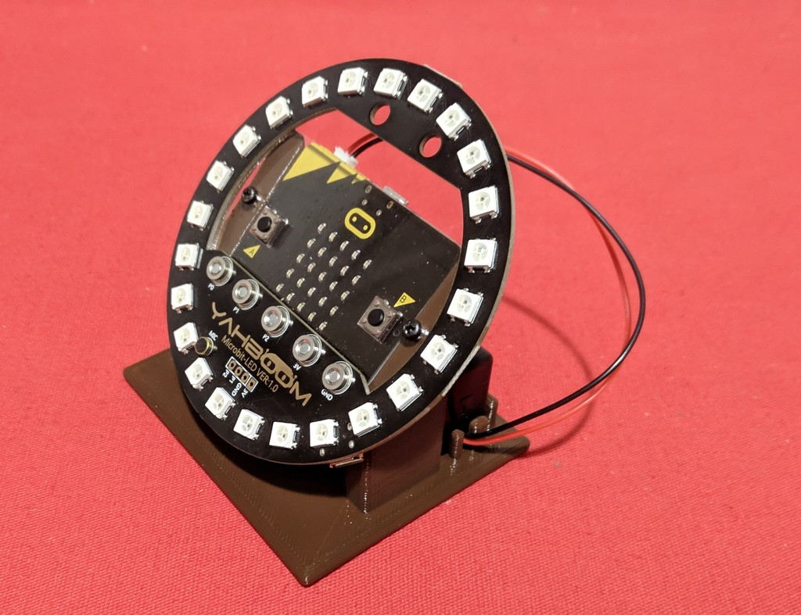
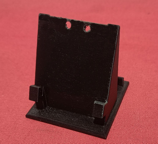

# Microbit-Stands
A holder helps to keep the Microbit in an ergonomic position and prevents shortcircuits  

  

Realitzat per [Jordi Mayné](https://github.com/maynej) des de Mechatronic Study jordi.mayne@mechatronicstudy.com 

La documentació està disponible també en castellà [en PDF](https://github.com/maynej/Microbit-holders/tree/main/Doc/). 

# Arxius per imprimir 
  
Descripció         | Imatge          | Arxiu STL    
------------- | ------------- | ------------- 
Microbit | | [Microbit](STL/MicrobitStand.stl)
Microbit Expander | | [Expander](STL/IO_Expander.stl)

Creative Commons Attribution-NoComercial-ShareAlike 4.0 International (CC BY-NC-SA 4.0)  

## QR

